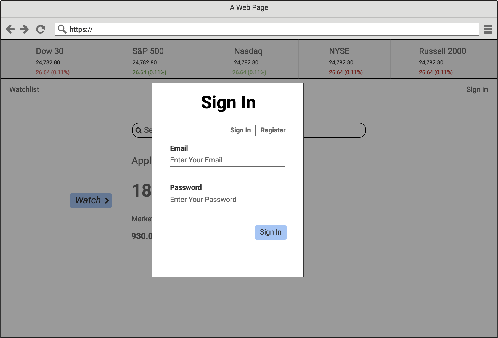
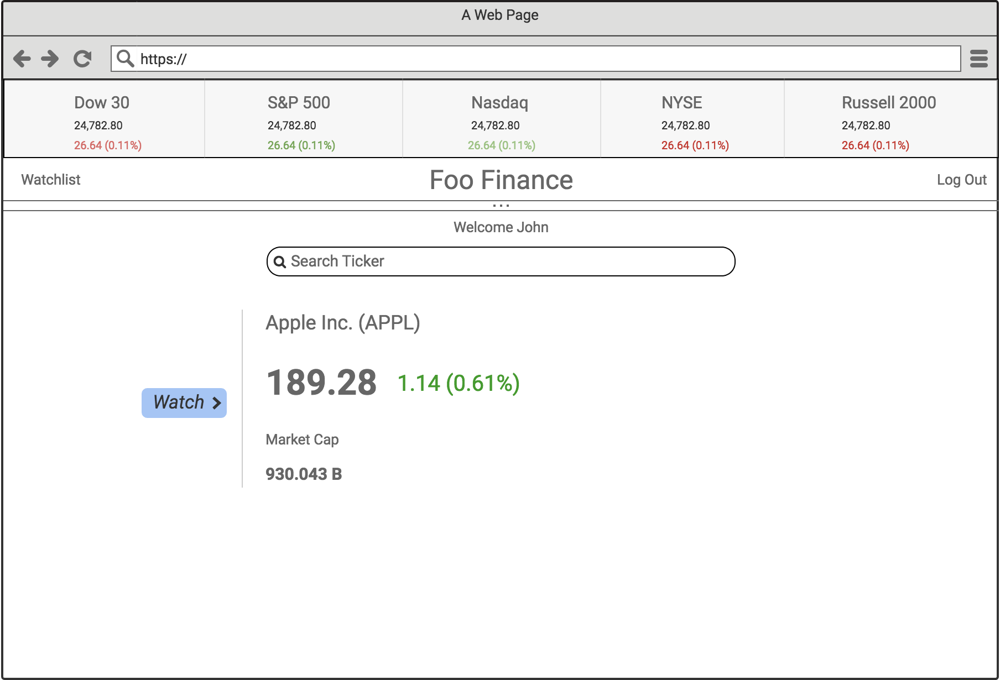

# FINVESTOR
#### By Amjad Ali
A Real Time Stock Watchlist for Investors. Users can search stocks using their ticker symbols, view real time quotes, and add stocks to their watchlist.  

## Instructions

  * Take a look at the Header at the very top of the page. You'll notice real time quotes of Facebook, Apple, Amazon, Netflix and Google, the _FAANG_ stocks, will always be shown here.
  * To view real time quotes of stocks in interest, use the search bar to input a ticker symbol (No need to sign in or register just yet).
  * If You wish to create a watchlist, sign in or register if you haven't already.
  * Click the _Sign In_ button on the top right corner of the page.
  * A Modal will popup with tabs to _Sign In_ or _Register_.
  * Once logged in, click the _Watch_ button to watch the stock.
  * You'll be redirected to your Watchlist where your real time quotes are shown.
  * If you wish to delete a stock from your watchlist, click the corresponding red _X_ on the far right of the stock.
  * Click _Home_ on the top left corner to go back to the main page.
  * Or click _Log out_ on the top left corner from anywhere in the app.

## Technology Used:
  
  * ReactJS, Javascript, HTML, CSS.
  * IEX Group Inc API.
  * [FINVESTOR API Developed By Me.](https://github.com/Amjad-H-Ali/Stock_Watchlist_API)
  
## API Info

See corresponding API repo at https://github.com/Amjad-H-Ali/Stock_Watchlist_API

## User Stories and WireFrames

#### User, whether signed in or not, should be able to search a stock's info using the ticker symbol.

#### User should be able to register or sign in.

#### User should be able to add stock to watchlist.

#### User should be able to view their watchlist.

#### User should be able to delete stock from watchlist.

#### User should be able to Logout.

